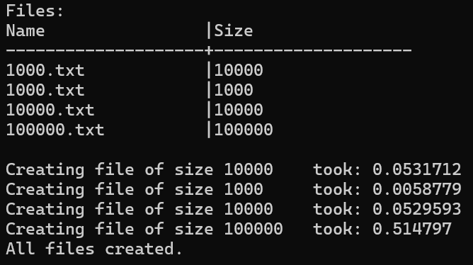

# Students

## Table of Contents
- [Description](#description)
- [Usage](#how-to-use-the-program)
- [Installation](#installation)
- [Releases](#releases)
- [Efficiency](#efficiency)

## Description
The **Students** application is designed to help work with students' data. Mainly for writing and reading 
data and quickly finding students' final results. Also, it is equipped with functions for programs' various speed measurements. 

## How to use the program
After running the program you will see the list of commands. Commands can be categorized into three categories: working with data, testing programs, and other additional commands.

### Working with data

* `Open` - After running the command, the user is asked to make [these](#printing-and-sorting-key-selection) selections. The user will be provided with a similar table:
   
Then user just needs to enter the ID of the files it wants to open.

* **Integer input** - After running the command, the user is asked to make [these](#printing-and-sorting-key-selection) selections. The integer he enters is the number of students, which data will have to be entered manually by the user. Every student's name and surname will have to be entered manually. Then there will be a couple of choices:
* 1. Enter the exam result and then the homework marks, and in the end, press ENTER twice.
* 2. Or enter `Auto` to generate exam results and a random number of homework marks. (Results are generated using Uniform Distribution.)

Here's a snippet of the code for data generating for one student:
```cpp
void Automatic_input(Stud& local)
{
	//Generate exam result and print them to terminal
	local.egz = Results_interval(rd_generator);
	cout << "\nGenerated egzam result: " << local.egz << endl;
	//Generate number of homeworks
	int amount = Amount_interval(rd_generator);
	//Generate and print homework marks
	local.nd.reserve(amount);
	cout << "Generated home work result: {";
	for (int i = 0; i < amount; i++) {
		local.nd.push_back(Results_interval(rd_generator));
		cout << local.nd[i] << ", ";}
	cout << "}" << endl;
}
```

### Testing the program

Here are the commands for measuring program efficiency, meant for optimizing the program.

* `Test` - This is the main command for testing the program's speed. After running the command, the user is asked to make [these](#printing-and-sorting-key-selection) selections. Then the user is provided with the same table of available **.txt** files. Then user needs to enter the IDs of files to be tested, also user can enter the same ID a few times and later get average value durations from all tests with that file.
   

* `Create` - This command is for creating test data. Users can create multiple files by writing the file name and size for each data file they want to create.  
 

* `Change`- This command lets the user change the container type (either **vector** or **list**) that will be used for storing students' data during processing.

* `Strategy` - This command lets the user choose one of 3 available strategies for categorizing students by their final result. [Here](#strategies) are the strategies.

* `Results` - This command prints tables in markdown format of testing data that was gathered since the start of running the program. Data is accumulated in these structures:

* Record
	- double **input**
	- double **sorting**
	- double **categorising**
	- double **output**
	- double **total**
	- int **count**

* Test_data
	- map<string, Record> **vec_test**
	- map<string, Record> **list_test**
	- map<string, double> **fg_durations**

### Additional commands

* `Info` - This command lists all commands for working with the program.

* `Show` - This command creates the table of available .txt files in the local directory. (**Debug** folder in version **v1.0**)

* `Check` - Prints currently used container type for storing data.

* `End` - For closing programs work.

### Printing and sorting key selection
For printing results to file, the user can choose one out of three options.

1. `Average` - to print the final result calculated using the average value of homework marks.
2. `Median` - to print the final result calculated using the median value of homework marks.
3. `Both` - to print both **1.** and **2.** options.

 

For sorting data user can choose up to two keys from four available:
* Name
* Surname
* Average
* Median

 

Here is the code for how sorting was implemented (key selection from user input and comparator selector):

```cpp
void find_keys(string& line, const enum selection& print_by, size_t& n_keys, vector<string>& keys)
{
	stringstream input(line),
		output;
	string key;
	bool name_used = false,
		surname_used = false,
		median_used = false,
		average_used = false;
	while (input >> key && n_keys < 2) {
		transform(key.begin(), key.end(), key.begin(), ::tolower);
		if (!name_used && key.substr(0, 3) == "nam") {
			output << "nam_";
			keys.push_back("Name");
			name_used = true;
			n_keys++;}
		else if (!surname_used && key.substr(0, 3) == "sur") {
			output << "sur_";
			keys.push_back("Surname");
			surname_used = true;
			n_keys++;}
		//<...>
		else continue;}
	line = output.str();
	line = line.substr(0, line.size() - 1);
}

template<typename T>
void sort_students(T& Students, const string& key) {
	map<string, int(*)(const Stud&, const Stud&)> comparators = {
		{"nam_sur", nam_sur}, {"nam_ave", nam_ave}
        /*<...>*/, {"med", med}};
	if constexpr (is_same<T, vector<Stud>>::value) {
		concurrency::parallel_sort(Students.begin(), Students.end(), comparators[key]);}
	else if constexpr (is_same<T, list<Stud>>::value) {
		Students.sort(comparators[key]);}
}
```

### Strategies

The program implements three strategies for categorizing students into two groups by their final results.

1. Creating two new containers and copying data from the main container to those containers by checking the users' category.
```cpp
template<typename T>
void sort_to_categories1(T& local, T& Under, T& Over)
{
	//<...>
	for (auto& i : local) {
		if (i.cat == Stud::Under) {
			Under.push_back(i);
			clean(i);}
		else {
			Over.push_back(i);
			clean(i);}
    }
}
```

2. Creating only one container and leaving one category of students in the first container and those that need to are copied to the new container and erased from the first one.
```cpp
template<typename T>
void sort_to_categories2(T& firstc, T& newc)
{
	//<...>
	for (auto it = firstc.begin(); it != firstc.end();) {
		if (it->cat == Stud::Under) {
			newc.emplace_back(*it);
			it = firstc.erase(it);}
		else {
			++it;}
	}
}
```

3. This strategy implements both previous strategies based on container type with some "improvements".
```cpp
template<typename T>
void sort_to_categories3(T& local, T& Under, T& Over)
{
	if constexpr (is_same<T, vector<Stud>>::value) {
		//<...>
		auto it = std::partition(local.begin(), local.end(), [&](const auto& a) {return a.cat == Stud::Under; });
		Under.assign(local.begin(), it);
		Over.assign(it, local.end());
		local.clear();}
	else {
		for (auto it = Over.begin(); it != Over.end();) {
			if (it->cat == Stud::Under) {
				Under.emplace_back(*it);
				it = Over.erase(it);}
			else {
				++it;}
		}
	}
}
```

## Efficiency

### System Specifications

* Processor (CPU)
    - **Model:** Intel(R) Core(TM) i3-1005G1
    - **Frequency:** 1.20 GHz (base)
    - **Number of Cores:** 2
    - **Number of Threads:** 4

* Memory (RAM)
    - **Capacity:** 20.0 GB
    - **Type:** DDR4

* Hard Drive (SSD)
    - **Type:** SSD (Solid State Drive)
    - **Capacity:** 224GB
    - **Read Speed:** Up to 520 MB/s
    - **Write Speed:** Up to 450 MB/s

### Speed measurements
Velocity was mesured using files of size `1 000`, `10 000`, `100 000`, `1 000 000` and `10 000 000`. 
Each speed result is an average of 5 tests for both containers (**list** and **vector**). 

### FILE GENERATION
| Size | Duration |
|:-------|-------:|
| 1000 | `0.006674` |
| 10000 | `0.054554` |
| 100000 | `0.512322` |
| 1000000 | `5.086912` |
| 10000000 | `51.815343` |

### DATA READING
| Size | Vector | List |
|:-------|:------:|:-------:|
| 1000 | `0.005005` | `0.005207` |
| 10000 | `0.046214` | `0.044371` |
| 100000 | `0.434032` | `0.426319` |
| 1000000 | `4.178495` | `4.207000` |
| 10000000 | `41.845112` | `42.497632` |

### DATA SORTING
| Size | Vector | List |
|:-------|:------:|:-------:|
| 1000 | `0.000207` | `0.000081` |
| 10000 | `0.002839` | `0.001170` |
| 100000 | `0.032434` | `0.013801` |
| 1000000 | `0.386295` | `0.166286` |
| 10000000 | `4.585012` | `2.141302` |

### DATA CATEGORISING
| Size | Vector | List |
|:-------|:------:|:-------:|
| 1000 | `0.000154` | `0.000287` |
| 10000 | `0.001738` | `0.002600` |
| 100000 | `0.016299` | `0.025073` |
| 1000000 | `0.154415` | `0.291918` |
| 10000000 | `1.543058` | `3.693453` |

### DATA OUTPUT
| Size | Vector | List |
|:-------|:------:|:-------:|
| 1000 | `0.002099` | `0.001803` |
| 10000 | `0.009379` | `0.009742` |
| 100000 | `0.084102` | `0.085847` |
| 1000000 | `0.736030` | `0.797156` |
| 10000000 | `7.606638` | `8.390945` |

### TOTAL DURATION
| Size | Vector | List |
|:-------|:------:|:-------:|
| 1000 | `0.009796` | `0.009347` |
| 10000 | `0.061101` | `0.058796` |
| 100000 | `0.567977` | `0.552731` |
| 1000000 | `5.456526` | `5.463538` |
| 10000000 | `55.581121` | `56.724722` |
